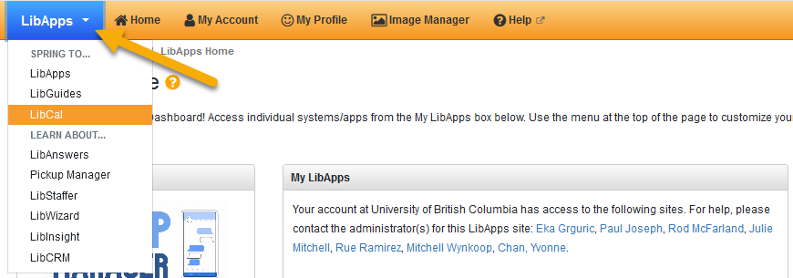
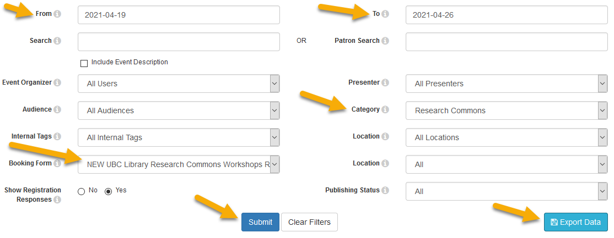
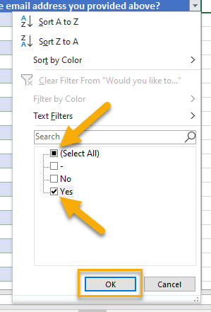
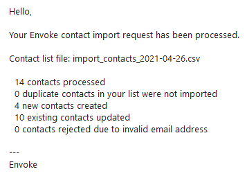

## How to import newsletter subscribers from LibCal into Envoke
1. Log in to LibCal as the Research Commons at [https://library-ubc-ca.libapps.com/libapps/login.php](https://library-ubc-ca.libapps.com/libapps/login.php).
    > See documentation for username and password.
2. Under the top-left "LibApps" dropdown, select "LibCal".

3. Click "Events" at the top of the page.

4. Click "Event Explorer" to the right of "UBC Vancouver Library Public Events".

5. Select the date range in the "From" and "To" fields for workshops you would like to include.
6. Select "NEW UBC Library Research Commons Workshops Registration Form" in the "Booking Form" field.
    > NOTE: It is important to select the form beginning with "NEW".
7. Select "Research Commons" in the "Category" field.
8. Click "Submit". (Any Research Commons' workshop held during this time period will appear below.)
9. Click "Export Data".

10. Open the downloaded CSV file.
11. Delete all columns, except for (1) "First Name", (2) "Last Name", (3) "Email", and (4) the one which asks whether participants would like to receive the newsletter.

12. If using Microsoft Excel, convert the worksheet into a table. (Select any cell within the desired table, and press "Ctrl + t". In the pop-up window, check the box labeled "My table has headers", and select "OK".)
13. Click the filter button in the lower right-hand corner of the "Would you like to receive the UBC Library Research Commons Monthly newsletter..." column header.    

14. In the filter dialog box, unselect "(Select All)". Select "Yes", then "OK".    

15. Select and copy the data within the "First Name", "Last Name", and "Email" columns, including column headers.
16. Open a new worksheet within the current workbook, and paste the data using "Paste Values". (This will import values, but not table formatting.)
17. Delete the first, original worksheet.
18. Save the file as a CSV.
19. Login to Envoke ([https://login.envoke.com/login.html](https://login.envoke.com/login.html)).
20. From the top-left "Contacts" dropdown, select "Import".

21. Drag or click anywhere within the upload box to import your file.

22. Ensure the data was imported correctly and that the fields were properly mapped in Steps 1 and 2.
23. Under "Step 3: List assignment and consent", click the "Select an existing subscription" box, and select "UBC Library Research Commons Newsletter".
24. Click the "Select consent status" box, and select "Implied - No Expiry".
25. Click the "Update consent status for existing contacts" radio button.

26. In the "Describe where the contacts are from and how consent was obtained..." box, enter wording to the effect of:
    > Contacts imported from UBC Library LibCal database. Consent explicitly acquired through workshop registration form, which asks participants whether they would like to receive the UBC Library Research Commons Newsletter.
27. Click the "Import" button in the bottom-right corner.

That's it! You should receive a confirmation email, like the one below, with import information regarding your contact list.

